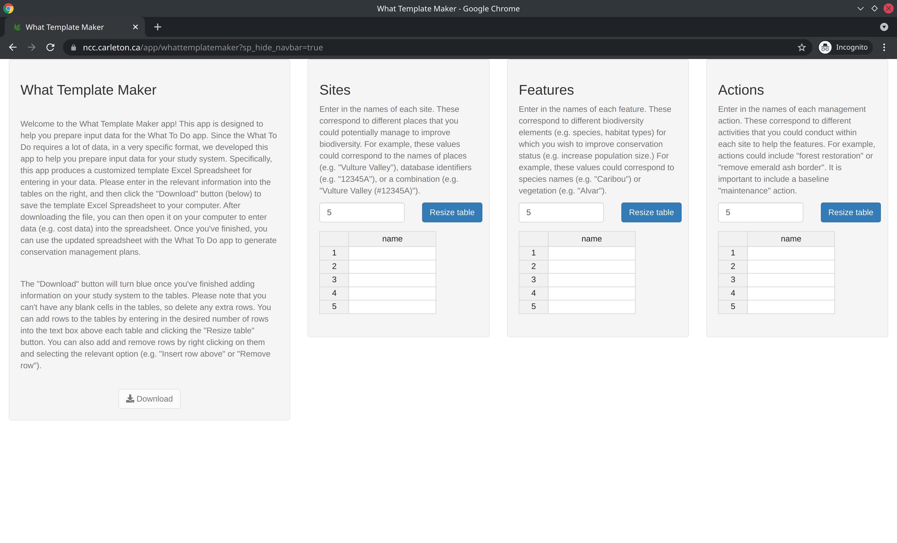

---
output:
  rmarkdown::github_document:
    html_preview: no
---

<!--- README.md is generated from README.Rmd. Please edit that file -->

# whattemplatemaker: Interactive data template application for the What To Do application

[](https://lifecycle.r-lib.org/articles/stages.html)
[](https://github.com/NCC-CNC/whattemplatemaker/actions)
[](https://github.com/NCC-CNC/whattemplatemaker/actions)
[](https://github.com/NCC-CNC/whattemplatemaker/actions)
[](https://hub.docker.com/r/naturecons/whattemplatemaker)
[](https://codecov.io/github/NCC-CNC/whattemplatemaker?branch=master)

```{r, include = FALSE}
knitr::opts_chunk$set(fig.path = "man/figures/README-", fig.align = "center")
```

```{r, include = FALSE}
devtools::load_all()
h = 2.75
w = 3.0
ow = "400"
```

The _What Template Maker_ is a tool that creates data templates for the [_What To Do_ application](https://github.com/NCC-CNC/whattodo). Since the _What To Do_ application requires data in a very specific format, this application is designed to help with preparing input data for the _What To Do_ application. After providing the names of sites, features, and actions, a template Excel Spreadsheet can then be downloaded from this application. The template Excel Spreadsheet can then be populated with data (e.g. longitude/latitude of sites) and, subsequently, uploaded to the _What To Do_ application to generate prioritizations.

## Usage

The application is [available online](https://ncc.carleton.ca). Please note that you must use [Google Chrome](https://www.google.com/chrome/) for it to work.

<table><tr><td></td></tr></table>

## Installation

The application is available as an online service provided by the [Nature Conservancy of Canada](https://natureconservancy.ca/en/). If you need to run the application on your own computer, then you can run it using the [R statistical computing environment](https://www.r-project.org/), [Docker](https://www.docker.com/), or [Docker Compose](https://docs.docker.com/compose/).

### Using R

To use this method, you will need to install the [R statistical computing environment](https://www.r-project.org/). After completing the installation, you can install the application using the following R code:

```{r, eval = FALSE}
if (!require(remotes)) install.packages("remotes")
remotes::install_github("NCC-CNC/whattemplatemaker")
```

You can then use the following R code to start the application and open it in your web browser:

```{r, eval = FALSE}
whattemplatemaker::run_app()
```

### Using Docker

To use this method, you will need to install [Docker Engine](https://www.docker.com/) ([see here for instructions](https://docs.docker.com/get-docker/)). After completing this step, you can install the application from the [DockerHub repository](https://hub.docker.com/repository/docker/naturecons/whattemplatemaker). Specifically, please use the following system command:

```{bash, eval = FALSE}
docker run -dp 3838:3838 --name whattemplatemaker -it naturecons/whattemplatemaker:latest
```

You can then view the application by opening the following link in [Google Chrome](https://www.google.com/chrome/): http://localhost:3838. After you have finished using the application, you can terminate it using the following system command. **Note that if you don't terminate the application once you are finished using it, then it will continue running in the background.**

```{bash, eval = FALSE}
docker rm -f whattemplatemaker
```

### Using Docker Compose

To use this method, you will need to install [Docker Engine](https://www.docker.com/) ([see here for instructions](https://docs.docker.com/get-docker/)) and Docker Compose ([see here for instructions](https://docs.docker.com/compose/install/)). After installing both programs, you can install the application by [cloning this repository](https://docs.github.com/en/github/creating-cloning-and-archiving-repositories/cloning-a-repository-from-github/cloning-a-repository) and then using the following system commands:

```{bash, eval = FALSE}
docker-compose pull
docker-compose up -d
```

You can then view the application by opening the following link in [Google Chrome](https://www.google.com/chrome/): http://localhost:3838. After you have finished using the application, you can terminate it using the following system command. **Note that if you don't terminate the application once you are finished using it, then it will continue running in the background.**

```{bash, eval = FALSE}
docker-compose down
```

## Contributing

The application is a [Shiny web application](https://mastering-shiny.org/) developed using the [R statistical computing environment](https://www.r-project.org/). Specifically, it uses the [`golem` framework](https://thinkr-open.github.io/golem/). This means that the application is effectively an [R package](https://r-pkgs.org/) that contains code for defining and launching the application ([see here for more details](https://engineering-shiny.org/)). The R code files (located in the `./R` directory) are organized using the following naming conventions:

* `app_*`: Defines the web application:
    * `app_config.R`: Imports configuration settings.
    * `app_global.R`: Initializes the application. It performs a similar to the `global.R` file in typical Shiny applications.
    * `app_server.R`: Defines the (back-end) server-side logic for the application. It performs a similar role to the `server.R` file in typical Shiny applications.
    * `app_ui.R`: Defines the (font-end) user interface for the application. It performs a similar role to the `ui.R` file in typical Shiny applications.
* `server_*`: Defines components used to assemble the server-side logic for the application.
* `ui_`*: Defines functions used to programmatically create HTML elements for the front-end of the application.
* `fct_*`:  Defines R functions used in the back-end of the application. These files contain code used to perform analyses and manipulate the classes.
* `utils_*`: Defines utility R functions used in the back-end of the application.

## Getting help

Thank you for checking out this application. If you encounter any software defects (e.g. application crashes, unexpected behavior, or spelling mistakes), please feel free to post them on the [issue tracker](https://github.com/NCC-CNC/whattemplatemaker/issues). If you have any questions about using this application, please contact [Dr. Richard Schuster](https://www.richard-schuster.com/) ([richard.schuster@natureconservancy.ca](mailto:richard.schuster@natureconservancy.ca)) or [Prof. Joe Bennett](https://carleton.ca/bennett-lab/lab-members/) ([JosephBennett@cunet.carleton.ca](mailto:mailto:JosephBennett@cunet.carleton.ca)).
